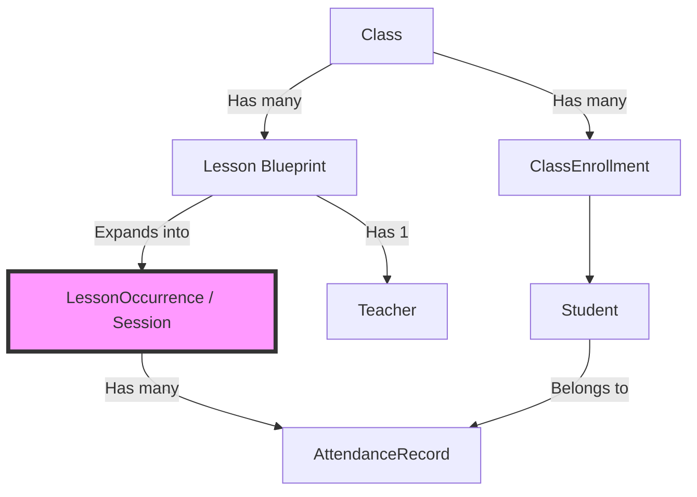

# Data Architecture: Classes, Lessons, and Sessions

This document outlines the core domain model and data flow for scheduling and attendance in TrackedUX.

## Core Concepts

The scheduling architecture is built on three main layers, moving from abstract definitions down to concrete historical facts.

### 1. Class (`classes` table)
The highest-level organizational unit.
- **Purpose**: Groups a set of students together for a shared curriculum or billing entity.
- **Properties**: Name, Center ID.
- **Relationships**: Has many `ClassEnrollment`s (students) and many `Lesson`s.

### 2. Lesson (`lessons` table)
The scheduling blueprint or rule. A class can have multiple lessons (e.g., a Math class might meet on Mondays and Thursdays; each is a separate `Lesson` row).
- **Purpose**: Defines *when* and *who* teaches.
- **Recurring Lessons**: Defined using an RFC 5545 `rrule` string (e.g., "Every Wednesday").
- **One-off / Make-up Lessons**: Defined using a `specific_date` (with no `rrule`).
- **Relationships**: Belongs to a `Class` and a `Teacher`.
- **Note**: Editing a `Lesson` affects all *future* occurrences of that schedule. 

### 3. Session / Occurrence (`lesson_occurrences` table)
A concrete, physical instance of a Lesson on a specific date. 
- **Purpose**: The anchor for recording attendance and displaying historical records.
- **Materialization Strategy**: 
  - **Future**: Occurrences are "virtual" (computed on-the-fly by expanding the `Lesson` RRULE). They do not exist in the database unless explicitly overridden.
  - **Current Week & Past**: Occurrences are "materialized" (written to the database). The system bulk-upserts occurrences whenever the weekly calendar is loaded or a new lesson is created.
- **Overrides**: If an admin reschedules a single session, cancels it, or changes its time, the exception is stored here (`override_date`, `override_start_time`, `status="canceled"`).
- **Relationships**: Belongs to a `Lesson`. Has many `AttendanceRecord`s.

---

## State Transitions & Data Flow

### 1. Creating a Schedule
When a new `Lesson` (recurring or one-off) is created:
1. The blueprint is saved in `lessons`.
2. A hook instantly calculates the occurrences that fall into the **current week** and inserts them into `lesson_occurrences`.
3. Future weeks remain virtual until navigated to.

### 2. Editing a Recurring Series
When an admin edits a `Lesson` (e.g., changing the start time from 10:00 AM to 3:00 PM):
1. **The Past is Frozen**: Before the `Lesson` is updated, the system finds all past `lesson_occurrences` and snapshots the old time (10:00 AM) into their `override_start_time` column. This ensures historical records don't retroactively jump to the afternoon.
2. **The Blueprint is Updated**: The `Lesson` receives the new 3:00 PM start time.
3. **Future Ghost Cleanup**: Any "clean" (no attendance marked, not manually rescheduled) future occurrences in the database are deleted. The new 3:00 PM rule will generate the new future sessions.

### 3. Manual Overrides (Exceptions)
When an admin reschedules or cancels a specific session from the calendar:
1. The system ensures a `lesson_occurrences` row exists for that specific `original_date`.
2. The override properties (`override_date`, `override_start_time`, or `status`) are applied to the row.
3. This override row will always take precedence over the `Lesson`'s RRULE when the calendar is rendered.

### 4. Taking Attendance
When a teacher submits attendance:
1. The system ensures the `lesson_occurrences` row is materialized.
2. `AttendanceRecord` rows are linked directly to the `lesson_occurrences.id`.
3. Even if the parent `Lesson` is deactivated or deleted later, the materialized `lesson_occurrences` and `AttendanceRecord`s remain intact, preserving historical business data.

---

## Summary Diagram

