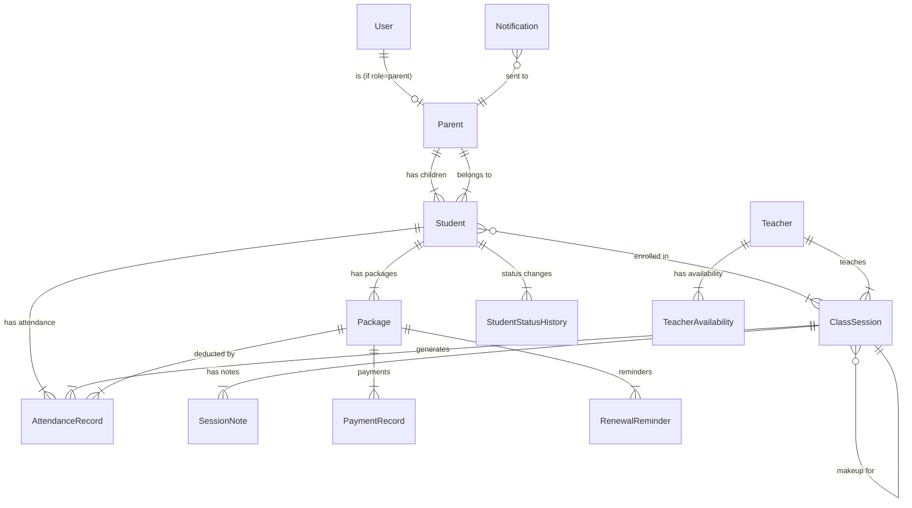

# Data Model: Piano Center Management System

**Phase**: 1 — Design & Contracts  
**Date**: 2026-04-27  
**Spec**: `specs/001-piano-center-management/spec.md`

---

## Entity Relationship Diagram



---

## Entities

### 1. User

Authentication entity for all system users.

| Field | Type | Constraints | Description |
|-------|------|-------------|-------------|
| `id` | UUID | PK | Primary key |
| `username` | VARCHAR(100) | UNIQUE, NOT NULL | Login username |
| `email` | VARCHAR(255) | UNIQUE, nullable | Email address |
| `password_hash` | VARCHAR(255) | NOT NULL | Bcrypt hashed password |
| `role` | ENUM('admin', 'staff', 'parent') | NOT NULL | User role for RBAC |
| `full_name` | VARCHAR(200) | NOT NULL | Display name |
| `language` | VARCHAR(5) | DEFAULT 'vi' | Preferred language (vi/en) |
| `is_active` | BOOLEAN | DEFAULT true | Account active status |
| `created_at` | TIMESTAMPTZ | NOT NULL | Creation timestamp |
| `updated_at` | TIMESTAMPTZ | NOT NULL | Last update timestamp |

**Indexes**: `username` (unique), `email` (unique), `role`

---

### 2. Parent

Parent/guardian of students. Linked to User for portal access.

| Field | Type | Constraints | Description |
|-------|------|-------------|-------------|
| `id` | UUID | PK | Primary key |
| `user_id` | UUID | FK → User, UNIQUE, nullable | Portal login (null if no portal access yet) |
| `full_name` | VARCHAR(200) | NOT NULL | Parent's full name |
| `phone` | VARCHAR(20) | NOT NULL | Primary phone (for Zalo/SMS) |
| `phone_secondary` | VARCHAR(20) | nullable | Secondary phone |
| `address` | TEXT | nullable | Home address |
| `zalo_id` | VARCHAR(100) | nullable | Zalo account identifier (Phase 2) |
| `notes` | TEXT | nullable | Admin notes about parent |
| `created_at` | TIMESTAMPTZ | NOT NULL | Creation timestamp |
| `updated_at` | TIMESTAMPTZ | NOT NULL | Last update timestamp |

**Indexes**: `user_id` (unique), `phone`  
**RBAC**: Staff MUST NOT see `phone`, `phone_secondary`, `address`

---

### 3. Student

A learner enrolled at the center.

| Field | Type | Constraints | Description |
|-------|------|-------------|-------------|
| `id` | UUID | PK | Primary key |
| `parent_id` | UUID | FK → Parent, NOT NULL | Guardian |
| `name` | VARCHAR(200) | NOT NULL | Student's name |
| `nickname` | VARCHAR(100) | nullable | Preferred nickname |
| `date_of_birth` | DATE | nullable | Date of birth |
| `age` | INTEGER | nullable | Age (auto-calculated or manual) |
| `skill_level` | VARCHAR(50) | NOT NULL | Current piano skill level |
| `personality_notes` | TEXT | nullable | Personality traits |
| `learning_speed` | VARCHAR(50) | nullable | Fast / Normal / Slow |
| `current_issues` | TEXT | nullable | Current learning issues |
| `enrollment_status` | ENUM('trial', 'active', 'paused', 'withdrawn') | NOT NULL, DEFAULT 'trial' | Current status |
| `enrolled_at` | DATE | NOT NULL | Date of enrollment |
| `created_at` | TIMESTAMPTZ | NOT NULL | Creation timestamp |
| `updated_at` | TIMESTAMPTZ | NOT NULL | Last update timestamp |

**Indexes**: `parent_id`, `enrollment_status`, `skill_level`, `name`  
**Validation**:
- `enrollment_status` must be one of: trial, active, paused, withdrawn
- `skill_level` is free-text but suggested values: Beginner, Elementary, Intermediate, Advanced
- `learning_speed` suggested values: Fast, Normal, Slow

**State Transitions**:
```
trial → active → paused → active (resume)
trial → withdrawn
active → withdrawn
paused → withdrawn
```

---

### 4. StudentStatusHistory

Audit trail of student status changes.

| Field | Type | Constraints | Description |
|-------|------|-------------|-------------|
| `id` | UUID | PK | Primary key |
| `student_id` | UUID | FK → Student, NOT NULL | Student reference |
| `from_status` | VARCHAR(20) | nullable | Previous status (null for initial) |
| `to_status` | VARCHAR(20) | NOT NULL | New status |
| `changed_by` | UUID | FK → User, NOT NULL | Who made the change |
| `reason` | TEXT | nullable | Reason for change |
| `changed_at` | TIMESTAMPTZ | NOT NULL | When changed |

**Indexes**: `student_id`, `changed_at`

---

### 5. Teacher

Instructor who teaches classes.

| Field | Type | Constraints | Description |
|-------|------|-------------|-------------|
| `id` | UUID | PK | Primary key |
| `user_id` | UUID | FK → User, UNIQUE, nullable | System login (optional) |
| `full_name` | VARCHAR(200) | NOT NULL | Teacher's full name |
| `phone` | VARCHAR(20) | nullable | Contact phone |
| `email` | VARCHAR(255) | nullable | Contact email |
| `notes` | TEXT | nullable | Admin notes |
| `is_active` | BOOLEAN | DEFAULT true | Currently teaching |
| `created_at` | TIMESTAMPTZ | NOT NULL | Creation timestamp |
| `updated_at` | TIMESTAMPTZ | NOT NULL | Last update timestamp |

**Indexes**: `user_id` (unique), `is_active`

---

### 6. TeacherAvailability

Weekly availability slots for a teacher.

| Field | Type | Constraints | Description |
|-------|------|-------------|-------------|
| `id` | UUID | PK | Primary key |
| `teacher_id` | UUID | FK → Teacher, NOT NULL | Teacher reference |
| `day_of_week` | INTEGER | NOT NULL, 0-6 | 0=Monday, 6=Sunday |
| `start_time` | TIME | NOT NULL | Slot start time |
| `end_time` | TIME | NOT NULL | Slot end time |

**Indexes**: `teacher_id`, (`teacher_id`, `day_of_week`)  
**Validation**: `start_time < end_time`

---

### 7. ClassSession

A recurring or one-off class session.

| Field | Type | Constraints | Description |
|-------|------|-------------|-------------|
| `id` | UUID | PK | Primary key |
| `teacher_id` | UUID | FK → Teacher, NOT NULL | Assigned teacher |
| `class_type` | ENUM('individual', 'pair', 'group') | NOT NULL | 1:1, pair, or group |
| `title` | VARCHAR(200) | nullable | Optional class title |
| `day_of_week` | INTEGER | NOT NULL, 0-6 | Recurring day (0=Monday) |
| `start_time` | TIME | NOT NULL | Session start time |
| `end_time` | TIME | NOT NULL | Session end time |
| `is_recurring` | BOOLEAN | DEFAULT true | Recurring weekly |
| `is_makeup` | BOOLEAN | DEFAULT false | Makeup session flag |
| `makeup_for_id` | UUID | FK → ClassSession, nullable | Original missed session |
| `specific_date` | DATE | nullable | For non-recurring/makeup sessions |
| `max_students` | INTEGER | NOT NULL | Max capacity (1, 2, or 4) |
| `is_active` | BOOLEAN | DEFAULT true | Class is active |
| `created_at` | TIMESTAMPTZ | NOT NULL | Creation timestamp |
| `updated_at` | TIMESTAMPTZ | NOT NULL | Last update timestamp |

**Indexes**: `teacher_id`, `day_of_week`, (`day_of_week`, `start_time`), `is_active`  
**Validation**:
- `max_students` must match `class_type`: individual=1, pair=2, group=4
- `start_time < end_time`
- If `is_makeup=true`, `specific_date` is required

---

### 8. ClassEnrollment (Join Table)

Links students to class sessions.

| Field | Type | Constraints | Description |
|-------|------|-------------|-------------|
| `id` | UUID | PK | Primary key |
| `class_session_id` | UUID | FK → ClassSession, NOT NULL | Class reference |
| `student_id` | UUID | FK → Student, NOT NULL | Student reference |
| `enrolled_at` | TIMESTAMPTZ | NOT NULL | When enrolled |
| `is_active` | BOOLEAN | DEFAULT true | Currently enrolled |

**Indexes**: (`class_session_id`, `student_id`) UNIQUE, `student_id`  
**Validation**: Cannot exceed `ClassSession.max_students` active enrollments

---

### 9. Package

A purchased bundle of sessions assigned to a student.

| Field | Type | Constraints | Description |
|-------|------|-------------|-------------|
| `id` | UUID | PK | Primary key |
| `student_id` | UUID | FK → Student, NOT NULL | Student reference |
| `total_sessions` | INTEGER | NOT NULL, CHECK > 0 | Total sessions purchased |
| `remaining_sessions` | INTEGER | NOT NULL | Remaining (can go negative) |
| `package_type` | VARCHAR(20) | NOT NULL | '12', '24', '36', or 'custom' |
| `price` | BIGINT | NOT NULL | Price in VND (stored as integer) |
| `payment_status` | ENUM('paid', 'unpaid') | NOT NULL, DEFAULT 'unpaid' | Payment status |
| `is_active` | BOOLEAN | DEFAULT true | Currently active package |
| `reminder_status` | VARCHAR(20) | DEFAULT 'none' | 'none', 'reminded_once', 'reminded_twice' |
| `started_at` | DATE | NOT NULL | Package start date |
| `expired_at` | DATE | nullable | Package end date (if applicable) |
| `created_at` | TIMESTAMPTZ | NOT NULL | Creation timestamp |
| `updated_at` | TIMESTAMPTZ | NOT NULL | Last update timestamp |

**Indexes**: `student_id`, (`student_id`, `is_active`), `payment_status`  
**Validation**:
- `total_sessions >= 1` (edge case: reject 0)
- Only one active package per student at a time
- `remaining_sessions` can go negative (owing status)

**Business Rules**:
- When `remaining_sessions <= 2` → trigger renewal reminder
- When `remaining_sessions <= 0` and student attends → student flagged as "owing"
- New package replaces (deactivates) previous active package

---

### 10. PaymentRecord

Payment history for packages.

| Field | Type | Constraints | Description |
|-------|------|-------------|-------------|
| `id` | UUID | PK | Primary key |
| `package_id` | UUID | FK → Package, NOT NULL | Package reference |
| `amount` | BIGINT | NOT NULL | Amount in VND |
| `payment_date` | DATE | NOT NULL | Date of payment |
| `payment_method` | VARCHAR(50) | nullable | Cash, Bank Transfer, etc. |
| `notes` | TEXT | nullable | Payment notes |
| `recorded_by` | UUID | FK → User, NOT NULL | Who recorded |
| `created_at` | TIMESTAMPTZ | NOT NULL | Creation timestamp |

**Indexes**: `package_id`, `payment_date`

---

### 11. AttendanceRecord

Per-student, per-session attendance log.

| Field | Type | Constraints | Description |
|-------|------|-------------|-------------|
| `id` | UUID | PK | Primary key |
| `class_session_id` | UUID | FK → ClassSession, NOT NULL | Class reference |
| `student_id` | UUID | FK → Student, NOT NULL | Student reference |
| `package_id` | UUID | FK → Package, nullable | Active package at time of attendance |
| `session_date` | DATE | NOT NULL | Date of the session |
| `status` | ENUM('present', 'absent', 'absent_with_notice') | NOT NULL | Attendance status |
| `makeup_scheduled` | BOOLEAN | DEFAULT false | Makeup session requested |
| `makeup_session_id` | UUID | FK → ClassSession, nullable | Linked makeup session |
| `marked_by` | UUID | FK → User, NOT NULL | Who marked attendance |
| `notes` | TEXT | nullable | Attendance notes |
| `created_at` | TIMESTAMPTZ | NOT NULL | Creation timestamp |
| `updated_at` | TIMESTAMPTZ | NOT NULL | Last update timestamp |

**Indexes**: (`class_session_id`, `student_id`, `session_date`) UNIQUE, `student_id`, `session_date`  
**Business Rules**:
- When `status = 'present'` → decrement `Package.remaining_sessions` by 1
- When `status = 'absent_with_notice'` → allow scheduling makeup
- Group classes continue running regardless of individual absences

---

### 12. SessionNote (Phase 2)

Teacher's post-class notes.

| Field | Type | Constraints | Description |
|-------|------|-------------|-------------|
| `id` | UUID | PK | Primary key |
| `class_session_id` | UUID | FK → ClassSession, NOT NULL | Class reference |
| `student_id` | UUID | FK → Student, NOT NULL | Student (notes per student) |
| `teacher_id` | UUID | FK → Teacher, NOT NULL | Note author |
| `session_date` | DATE | NOT NULL | Session date |
| `lesson_content` | TEXT | nullable | What was taught |
| `progress_notes` | TEXT | nullable | Student progress |
| `homework` | TEXT | nullable | Assigned homework |
| `created_at` | TIMESTAMPTZ | NOT NULL | Creation timestamp |
| `updated_at` | TIMESTAMPTZ | NOT NULL | Last update timestamp |

**Indexes**: (`class_session_id`, `student_id`, `session_date`), `student_id`

---

### 13. Notification (Phase 2)

Automated messages sent to parents.

| Field | Type | Constraints | Description |
|-------|------|-------------|-------------|
| `id` | UUID | PK | Primary key |
| `parent_id` | UUID | FK → Parent, NOT NULL | Recipient parent |
| `type` | ENUM('schedule_reminder', 'payment_due', 'payment_overdue', 'renewal_reminder') | NOT NULL | Notification type |
| `channel` | ENUM('zalo', 'sms') | NOT NULL | Delivery channel |
| `status` | ENUM('pending', 'sent', 'failed') | NOT NULL, DEFAULT 'pending' | Delivery status |
| `content` | TEXT | NOT NULL | Message content |
| `reference_id` | UUID | nullable | Related entity (class/package) |
| `sent_at` | TIMESTAMPTZ | nullable | When sent |
| `error_message` | TEXT | nullable | Failure reason |
| `created_at` | TIMESTAMPTZ | NOT NULL | Creation timestamp |

**Indexes**: `parent_id`, `status`, `type`, `created_at`

---

### 14. RenewalReminder

Tracks renewal reminder status for packages.

| Field | Type | Constraints | Description |
|-------|------|-------------|-------------|
| `id` | UUID | PK | Primary key |
| `package_id` | UUID | FK → Package, NOT NULL | Package reference |
| `reminder_number` | INTEGER | NOT NULL | 1 or 2 |
| `triggered_at` | TIMESTAMPTZ | NOT NULL | When triggered |
| `notification_id` | UUID | FK → Notification, nullable | Linked notification (Phase 2) |

**Indexes**: (`package_id`, `reminder_number`) UNIQUE

---

## Migration Plan

Following the user-specified sequential numbering:

| Version | File | Description |
|---------|------|-------------|
| 001 | `001_init_extensions.py` | PostgreSQL extensions (uuid-ossp, unaccent, pg_trgm) |
| 002 | `002_users_and_auth.py` | User table with roles, indexes |
| 003 | `003_parents_and_students.py` | Parent, Student, StudentStatusHistory tables |
| 004 | `004_teachers_and_availability.py` | Teacher, TeacherAvailability tables |
| 005 | `005_classes_and_enrollment.py` | ClassSession, ClassEnrollment tables |
| 006 | `006_packages_and_payments.py` | Package, PaymentRecord, RenewalReminder tables |
| 007 | `007_attendance.py` | AttendanceRecord table |
| 008 | `008_session_notes.py` | SessionNote table (Phase 2, can be created early) |
| 009 | `009_notifications.py` | Notification table (Phase 2, can be created early) |

---

## Enum Definitions (PostgreSQL)

```sql
CREATE TYPE user_role AS ENUM ('admin', 'staff', 'parent');
CREATE TYPE enrollment_status AS ENUM ('trial', 'active', 'paused', 'withdrawn');
CREATE TYPE class_type AS ENUM ('individual', 'pair', 'group');
CREATE TYPE payment_status AS ENUM ('paid', 'unpaid');
CREATE TYPE attendance_status AS ENUM ('present', 'absent', 'absent_with_notice');
CREATE TYPE notification_type AS ENUM ('schedule_reminder', 'payment_due', 'payment_overdue', 'renewal_reminder');
CREATE TYPE notification_channel AS ENUM ('zalo', 'sms');
CREATE TYPE notification_status AS ENUM ('pending', 'sent', 'failed');
```

---

## Currency Handling

All monetary values stored as `BIGINT` in Vietnamese Dong (VND). VND has no decimal subdivision, so integer storage is lossless. Frontend formats with thousand separators (e.g., `1.200.000 ₫`).
