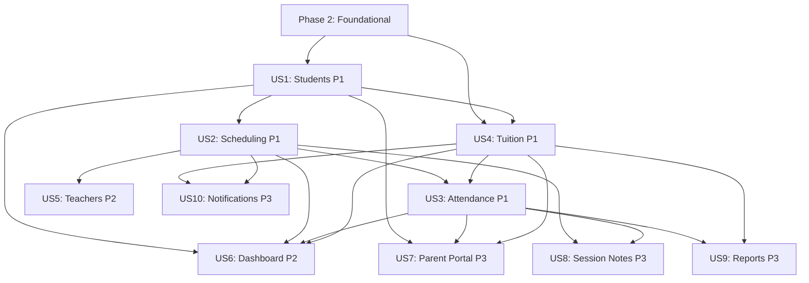

# Tasks: Piano Center Management System

**Input**: Design documents from `/specs/001-piano-center-management/`
**Prerequisites**: plan.md, spec.md, research.md, data-model.md, contracts/

**Tests**: Not explicitly requested — test tasks omitted. Add via `/speckit-tasks --with-tests` if needed.

**Organization**: Tasks grouped by user story (10 stories from spec.md). Each story is independently implementable and testable after foundational phase.

## Format: `[ID] [P?] [Story] Description`

- **[P]**: Can run in parallel (different files, no dependencies)
- **[Story]**: Which user story this task belongs to (e.g., US1, US2)
- Include exact file paths in descriptions

---

## Phase 1: Setup (Shared Infrastructure)

**Purpose**: Project initialization, tooling, and basic structure

- [X] T001 Create project root structure: `backend/`, `frontend/`, `specs/`, `README.md`, `.gitignore`
- [X] T002 Initialize backend Python project with `backend/pyproject.toml` (FastAPI, SQLAlchemy[asyncio], asyncpg, pydantic, python-jose, passlib[bcrypt], alembic, uvicorn)
- [X] T003 [P] Initialize frontend React project with Vite in `frontend/` (react, react-dom, react-router-dom, antd, @ant-design/icons, react-i18next, i18next, @tanstack/react-query, axios, @fullcalendar/react, @fullcalendar/daygrid, @fullcalendar/timegrid)
- [X] T004 [P] Configure backend linting with `backend/ruff.toml` (line-length=120, Python 3.11 target)
- [X] T005 [P] Configure frontend linting with `frontend/.eslintrc.cjs` and `frontend/.prettierrc`
- [X] T006 [P] Create `backend/.env.example` with DATABASE_URL, JWT_SECRET, JWT_ALGORITHM, ACCESS_TOKEN_TTL_MINUTES, REFRESH_TOKEN_TTL_DAYS, DEFAULT_LANGUAGE
- [X] T007 [P] Create `frontend/.env.example` with VITE_API_BASE_URL=http://localhost:8000/api/v1
- [X] T008 [P] Configure PWA with `vite-plugin-pwa` in `frontend/vite.config.js` (manifest, service worker, icons)
- [X] T009 Copy `specs/001-piano-center-management/quickstart.md` content to root `README.md`

---

## Phase 2: Foundational (Blocking Prerequisites)

**Purpose**: Core infrastructure that MUST be complete before ANY user story

**⚠️ CRITICAL**: No user story work can begin until this phase is complete

### Database & ORM Setup

- [X] T010 Create database engine and async session factory in `backend/app/db/session.py`
- [X] T011 Create SQLAlchemy declarative base with common columns (id UUID, created_at, updated_at) in `backend/app/db/base.py`
- [X] T012 Configure Alembic with async support in `backend/alembic.ini` and `backend/alembic/env.py`
- [X] T013 Create migration `backend/alembic/versions/001_init_extensions.py` (uuid-ossp, unaccent, pg_trgm extensions)
- [X] T014 Create PostgreSQL enum types migration `backend/alembic/versions/002_enum_types.py` (user_role, enrollment_status, class_type, payment_status, attendance_status, notification_type, notification_channel, notification_status)

### Configuration & Security

- [X] T015 [P] Implement app config with Pydantic Settings in `backend/app/core/config.py` (load from .env)
- [X] T016 [P] Implement JWT security utilities in `backend/app/core/security.py` (create_access_token, create_refresh_token, verify_token, hash_password, verify_password)
- [X] T017 Create FastAPI dependencies in `backend/app/core/deps.py` (get_db session, get_current_user, require_role decorator)

### User & Auth Foundation

- [X] T018 Create User SQLAlchemy model in `backend/app/models/user.py` (id, username, email, password_hash, role, full_name, language, is_active)
- [X] T019 Create User Pydantic schemas in `backend/app/schemas/user.py` (UserCreate, UserUpdate, UserResponse, LoginRequest, TokenResponse)
- [X] T020 Create User CRUD operations in `backend/app/crud/user.py` (create, get_by_id, get_by_username, update)
- [X] T021 Create migration `backend/alembic/versions/003_users.py` for User table
- [X] T022 Implement auth API routes in `backend/app/api/auth.py` (POST /login, POST /refresh, POST /logout, GET /me)

### FastAPI App Bootstrap

- [X] T023 Create FastAPI application entry point in `backend/app/main.py` (CORS config, router includes, lifespan)
- [X] T024 Create API router registry in `backend/app/api/__init__.py` (include all route modules under /api/v1)
- [X] T025 Create seed script in `backend/app/scripts/seed.py` (create default admin user: admin/admin123)

### Frontend Foundation

- [X] T026 [P] Create API client with axios interceptors in `frontend/src/api/client.js` (base URL, JWT attach, 401 refresh logic)
- [X] T027 [P] Create AuthContext and AuthProvider in `frontend/src/auth/AuthContext.jsx` (login, logout, user state, token storage)
- [X] T028 [P] Create ProtectedRoute component in `frontend/src/auth/ProtectedRoute.jsx` (role-based route guard)
- [X] T029 [P] Create LoginPage in `frontend/src/auth/LoginPage.jsx` (username/password form, bilingual)
- [X] T030 [P] Configure i18n with react-i18next in `frontend/src/i18n/index.js`, create `frontend/src/i18n/en.json` and `frontend/src/i18n/vi.json` with common namespace
- [X] T031 [P] Create shared Layout component in `frontend/src/components/Layout.jsx` (header, sidebar nav, content area, language switcher)
- [X] T032 [P] Create LanguageSwitcher component in `frontend/src/components/LanguageSwitcher.jsx` (VI|EN toggle, persist to localStorage)
- [X] T033 Create route definitions in `frontend/src/routes/index.jsx` (all routes from contracts/ui.md with role guards)
- [X] T034 Create App shell in `frontend/src/App.jsx` (AuthProvider, QueryClientProvider, I18nextProvider, RouterProvider)
- [X] T035 [P] Create global CSS variables and theme in `frontend/src/styles/global.css` (Ant Design theme customization)

### PWA Foundation

- [X] T036 [P] Create InstallPrompt component in `frontend/src/pwa/InstallPrompt.jsx` (Android + iOS install banners, bilingual)
- [X] T037 [P] Create ConnectionBanner component in `frontend/src/pwa/ConnectionBanner.jsx` (offline warning bar, bilingual)
- [X] T038 [P] Create UpdatePrompt component in `frontend/src/pwa/UpdatePrompt.jsx` (service worker update notification)

**Checkpoint**: Foundation ready — user story implementation can now begin

---

## Phase 3: User Story 1 — Admin Manages Students (Priority: P1) 🎯 MVP

**Goal**: Admin can register, edit, search, and filter students with full profile data. Staff sees limited view (no parent contact).

**Independent Test**: Create, edit, and search students. Verify all fields persist. Verify staff cannot see parent phone/address.

### Backend

- [X] T039 [P] [US1] Create Parent model in `backend/app/models/parent.py` (id, user_id, full_name, phone, phone_secondary, address, zalo_id, notes)
- [X] T040 [P] [US1] Create Student model in `backend/app/models/student.py` (id, parent_id, name, nickname, date_of_birth, age, skill_level, personality_notes, learning_speed, current_issues, enrollment_status, enrolled_at)
- [X] T041 [P] [US1] Create StudentStatusHistory model in `backend/app/models/student_status_history.py` (id, student_id, from_status, to_status, changed_by, reason, changed_at)
- [X] T042 [US1] Create migration `backend/alembic/versions/004_parents_students.py` for Parent, Student, StudentStatusHistory tables
- [X] T043 [P] [US1] Create Parent Pydantic schemas in `backend/app/schemas/parent.py` (ParentCreate, ParentUpdate, ParentResponse)
- [X] T044 [P] [US1] Create Student Pydantic schemas in `backend/app/schemas/student.py` (StudentCreate, StudentUpdate, StudentResponse, StudentListItem, StudentStatusChange)
- [X] T045 [P] [US1] Create Parent CRUD in `backend/app/crud/parent.py` (create, get_by_id, list, update)
- [X] T046 [P] [US1] Create Student CRUD in `backend/app/crud/student.py` (create, get_by_id, list with filters/sort/search, update, change_status)
- [X] T047 [US1] Implement Student service with business logic in `backend/app/services/student_service.py` (status transition validation, status history recording, unaccented search)
- [X] T048 [US1] Implement Parent API routes in `backend/app/api/parents.py` (GET list, GET detail, POST create, PATCH update — admin only)
- [X] T049 [US1] Implement Student API routes in `backend/app/api/students.py` (GET list with filters, GET detail, POST create, PATCH update, PATCH status — RBAC: hide parent contact from staff)

### Frontend

- [X] T050 [P] [US1] Create student API module in `frontend/src/api/students.js` (listStudents, getStudent, createStudent, updateStudent, changeStatus)
- [X] T051 [P] [US1] Create parent API module in `frontend/src/api/parents.js` (listParents, getParent, createParent, updateParent)
- [X] T052 [US1] Create StudentList page in `frontend/src/features/students/StudentList.jsx` (Ant Design Table, search, filter by status/skill_level, sort, pagination)
- [X] T053 [US1] Create StudentForm page in `frontend/src/features/students/StudentForm.jsx` (create/edit form with parent selection, all fields from data model)
- [X] T054 [US1] Create StudentDetail page in `frontend/src/features/students/StudentDetail.jsx` (profile view with tabs: Info, Classes, Attendance, Tuition — RBAC field hiding)
- [X] T055 [US1] Add i18n translations for student/parent labels in `frontend/src/i18n/en.json` and `frontend/src/i18n/vi.json` (students namespace)

**Checkpoint**: Admin can fully manage students. Story 1 independently testable.

---

## Phase 4: User Story 2 — Admin Creates Classes and Schedules (Priority: P1)

**Goal**: Admin creates class sessions (1:1/pair/group), assigns teacher+students, sets weekly time. Calendar view shows schedule. Conflict detection prevents overlapping bookings.

**Independent Test**: Create classes with different types, assign students/teachers, verify calendar display and conflict detection.

### Backend

- [X] T056 [P] [US2] Create Teacher model in `backend/app/models/teacher.py` (id, user_id, full_name, phone, email, notes, is_active)
- [X] T057 [P] [US2] Create TeacherAvailability model in `backend/app/models/teacher_availability.py` (id, teacher_id, day_of_week, start_time, end_time)
- [X] T058 [P] [US2] Create ClassSession model in `backend/app/models/class_session.py` (id, teacher_id, class_type, title, day_of_week, start_time, end_time, is_recurring, is_makeup, makeup_for_id, specific_date, max_students, is_active)
- [X] T059 [P] [US2] Create ClassEnrollment model in `backend/app/models/class_enrollment.py` (id, class_session_id, student_id, enrolled_at, is_active)
- [X] T060 [US2] Create migration `backend/alembic/versions/005_teachers.py` for Teacher, TeacherAvailability tables
- [X] T061 [US2] Create migration `backend/alembic/versions/006_classes.py` for ClassSession, ClassEnrollment tables
- [X] T062 [P] [US2] Create Teacher Pydantic schemas in `backend/app/schemas/teacher.py`
- [X] T063 [P] [US2] Create ClassSession Pydantic schemas in `backend/app/schemas/class_session.py`
- [X] T064 [P] [US2] Create Teacher CRUD in `backend/app/crud/teacher.py`
- [X] T065 [P] [US2] Create ClassSession CRUD in `backend/app/crud/class_session.py` (with enrollment count checks)
- [X] T066 [US2] Implement scheduling service in `backend/app/services/schedule_service.py` (conflict detection for student+teacher time overlaps, max capacity enforcement, teacher availability validation)
- [X] T067 [US2] Implement Teacher API routes in `backend/app/api/teachers.py` (CRUD + PUT availability)
- [X] T068 [US2] Implement Class API routes in `backend/app/api/classes.py` (CRUD + POST enroll + DELETE unenroll + conflict 409 responses)
- [X] T069 [US2] Implement Schedule API route in `backend/app/api/schedule.py` (GET /schedule/weekly with week_start and teacher_id filters)

### Frontend

- [X] T070 [P] [US2] Create teacher API module in `frontend/src/api/teachers.js`
- [X] T071 [P] [US2] Create class/schedule API module in `frontend/src/api/classes.js`
- [X] T072 [US2] Create TeacherList page in `frontend/src/features/teachers/TeacherList.jsx`
- [X] T073 [US2] Create TeacherForm page in `frontend/src/features/teachers/TeacherForm.jsx` (with availability slot editor)
- [X] T074 [US2] Create TeacherDetail page in `frontend/src/features/teachers/TeacherDetail.jsx`
- [X] T075 [US2] Create WeeklyCalendar page in `frontend/src/features/schedule/WeeklyCalendar.jsx` (FullCalendar weekly view, color-coded by class_type, teacher filter dropdown)
- [X] T076 [US2] Create ClassForm modal/page in `frontend/src/features/schedule/ClassForm.jsx` (type selection, teacher/student assignment, time slot picker, conflict error display)
- [X] T077 [US2] Create ClassDetail page in `frontend/src/features/schedule/ClassDetail.jsx` (enrolled students list, edit, unenroll)
- [X] T078 [US2] Add i18n translations for teacher/schedule labels in `frontend/src/i18n/en.json` and `frontend/src/i18n/vi.json` (teachers, schedule namespaces)

**Checkpoint**: Admin can create classes, manage teachers, view weekly calendar, detect conflicts. Story 2 independently testable.

---

## Phase 5: User Story 3 — Teacher/Admin Takes Attendance (Priority: P1)

**Goal**: Mark attendance per student per session (present/absent/absent with notice). Makeup scheduling for absences. Package session deduction on attendance.

**Independent Test**: Mark attendance for various states, verify package session counts decrease correctly, schedule makeup sessions.

### Backend

- [X] T079 [P] [US3] Create AttendanceRecord model in `backend/app/models/attendance.py` (id, class_session_id, student_id, package_id, session_date, status, makeup_scheduled, makeup_session_id, marked_by, notes)
- [X] T080 [US3] Create migration `backend/alembic/versions/007_attendance.py` for AttendanceRecord table
- [X] T081 [P] [US3] Create AttendanceRecord Pydantic schemas in `backend/app/schemas/attendance.py` (AttendanceBatchRequest, AttendanceBatchItem, AttendanceResponse)
- [X] T082 [US3] Implement attendance service in `backend/app/services/attendance_service.py` (batch marking, package session deduction on 'present', makeup session creation for 'absent_with_notice', remaining session calculation)
- [X] T083 [US3] Implement Attendance API routes in `backend/app/api/attendance.py` (GET list with filters, POST /attendance/batch, POST /attendance/{id}/makeup)

### Frontend

- [X] T084 [P] [US3] Create attendance API module in `frontend/src/api/attendance.js`
- [X] T085 [US3] Create AttendanceList page in `frontend/src/features/attendance/AttendanceList.jsx` (today's sessions, select session to mark)
- [X] T086 [US3] Create AttendanceBatchForm page in `frontend/src/features/attendance/AttendanceBatchForm.jsx` (student list with radio buttons: Present/Absent/Absent with Notice, shows remaining sessions per student, batch submit)
- [X] T087 [US3] Create MakeupScheduleModal in `frontend/src/features/attendance/MakeupScheduleModal.jsx` (date/time/teacher picker for makeup session)
- [X] T088 [US3] Add i18n translations for attendance labels in `frontend/src/i18n/en.json` and `frontend/src/i18n/vi.json` (attendance namespace)

**Checkpoint**: Attendance marking works with package deduction. Story 3 independently testable.

---

## Phase 6: User Story 4 — Admin Manages Tuition Packages (Priority: P1)

**Goal**: Admin assigns tuition packages (12/24/36/custom sessions), tracks payment status, remaining sessions, payment history. Renewal reminders at ≤2 sessions. Students can continue with negative balance (owing).

**Independent Test**: Create packages, record payments, verify reminder triggers and owing status.

### Backend

- [X] T089 [P] [US4] Create Package model in `backend/app/models/package.py` (id, student_id, total_sessions, remaining_sessions, package_type, price, payment_status, is_active, reminder_status, started_at, expired_at)
- [X] T090 [P] [US4] Create PaymentRecord model in `backend/app/models/payment_record.py` (id, package_id, amount, payment_date, payment_method, notes, recorded_by)
- [X] T091 [P] [US4] Create RenewalReminder model in `backend/app/models/renewal_reminder.py` (id, package_id, reminder_number, triggered_at, notification_id)
- [X] T092 [US4] Create migration `backend/alembic/versions/008_packages_payments.py` for Package, PaymentRecord, RenewalReminder tables
- [X] T093 [P] [US4] Create Package Pydantic schemas in `backend/app/schemas/package.py` (PackageCreate, PackageResponse, PaymentRecordCreate, PaymentRecordResponse)
- [X] T094 [P] [US4] Create Package CRUD in `backend/app/crud/package.py` (create, get_by_id, list with filters, get_active_for_student, update)
- [X] T095 [US4] Implement tuition service in `backend/app/services/tuition_service.py` (package creation with previous deactivation, payment recording, renewal reminder logic at ≤2 sessions, owing status detection, custom package validation — reject 0 sessions)
- [X] T096 [US4] Implement Package API routes in `backend/app/api/packages.py` (GET list, POST create, PATCH payment, GET /tuition/owing, GET /tuition/expiring)

### Frontend

- [X] T097 [P] [US4] Create tuition API module in `frontend/src/api/tuition.js`
- [X] T098 [US4] Create TuitionManagement page in `frontend/src/features/tuition/TuitionManagement.jsx` (Ant Design Table: students with package info, filter by payment status, owing list)
- [X] T099 [US4] Create PackageForm modal in `frontend/src/features/tuition/PackageForm.jsx` (package type selection 12/24/36/custom, price input in VND, validation)
- [X] T100 [US4] Create PaymentForm modal in `frontend/src/features/tuition/PaymentForm.jsx` (amount, date, method, notes)
- [X] T101 [US4] Create PackageCard component in `frontend/src/features/tuition/PackageCard.jsx` (progress bar, remaining sessions, payment badge, warning when ≤2, owing badge when negative)
- [X] T102 [US4] Add i18n translations for tuition labels in `frontend/src/i18n/en.json` and `frontend/src/i18n/vi.json` (tuition namespace)

**Checkpoint**: Full tuition lifecycle works. Story 4 independently testable.

---

## Phase 7: User Story 5 — Admin Manages Teachers (Priority: P2)

**Goal**: Admin adds teachers with name, contact, availability. Teachers assigned to classes. Schedule shows teacher per session.

**Independent Test**: Create teachers, set availability, assign to classes, verify calendar shows teacher names.

> **Note**: Teacher model and CRUD already created in Phase 4 (US2). This phase adds dedicated management pages and availability editing.

### Frontend (Backend already done in US2)

- [X] T103 [US5] Enhance TeacherDetail page in `frontend/src/features/teachers/TeacherDetail.jsx` (add availability visual grid editor, class assignment history)
- [X] T104 [US5] Create AvailabilityEditor component in `frontend/src/features/teachers/AvailabilityEditor.jsx` (weekly grid with draggable time slots)
- [X] T105 [US5] Add i18n translations for teacher management labels in `frontend/src/i18n/en.json` and `frontend/src/i18n/vi.json` (teachers namespace updates)

**Checkpoint**: Teacher management complete. Story 5 independently testable.

---

## Phase 8: User Story 6 — Dashboard Overview (Priority: P2)

**Goal**: Dashboard shows total active students, today's sessions, today's absences, students nearing package end, monthly revenue (admin only). Quick action buttons.

**Independent Test**: Verify dashboard metrics match actual system data. Verify revenue hidden for staff.

### Backend

- [X] T106 [US6] Implement dashboard service in `backend/app/services/dashboard_service.py` (aggregate metrics: active_students count, today_sessions count, today_absences count, expiring_packages count, monthly_revenue sum — admin only)
- [X] T107 [US6] Implement Dashboard API route in `backend/app/api/dashboard.py` (GET /dashboard — revenue field null for staff role)

### Frontend

- [X] T108 [P] [US6] Create dashboard API module in `frontend/src/api/dashboard.js`
- [X] T109 [US6] Create DashboardPage in `frontend/src/features/dashboard/DashboardPage.jsx` (metric cards with icons: active students, today sessions, absences, expiring packages, revenue — Ant Design Statistic components)
- [X] T110 [US6] Create MetricCard component in `frontend/src/features/dashboard/MetricCard.jsx` (icon, value, label, optional trend indicator)
- [X] T111 [US6] Create QuickActions component in `frontend/src/features/dashboard/QuickActions.jsx` (Add Student button → /students/new, Create Trial Class button → /classes/new)
- [X] T112 [US6] Add i18n translations for dashboard labels in `frontend/src/i18n/en.json` and `frontend/src/i18n/vi.json` (dashboard namespace)

**Checkpoint**: Dashboard displays accurate operational overview. Story 6 independently testable.

---

## Phase 9: User Story 7 — Parent Portal (Priority: P3, Phase 2)

**Goal**: Parent logs in with own credentials. Views child's schedule, attendance history, session notes, package details, payment status. Read-only access.

**Independent Test**: Login as parent, verify read-only access to child's data, no edit controls visible.

### Backend

- [X] T113 [US7] Implement portal service in `backend/app/services/portal_service.py` (get children for parent, child detail with schedule+attendance+package, verify parent-child ownership)
- [X] T114 [US7] Implement Parent Portal API routes in `backend/app/api/portal.py` (GET /portal/children, GET /portal/children/{id}, GET /portal/children/{id}/notes — parent role only, ownership check)
- [X] T115 [US7] Create parent user creation flow in seed script update `backend/app/scripts/seed.py` (link Parent record to User with role=parent)

### Frontend

- [X] T116 [P] [US7] Create portal API module in `frontend/src/api/portal.js`
- [X] T117 [US7] Create ParentPortalLayout in `frontend/src/features/portal/PortalLayout.jsx` (simplified layout — no sidebar, header only with lang/user)
- [X] T118 [US7] Create PortalHome page in `frontend/src/features/portal/PortalHome.jsx` (list of parent's children as cards)
- [X] T119 [US7] Create ChildDetail page in `frontend/src/features/portal/ChildDetail.jsx` (tabs: Schedule, Attendance History, Session Notes, Package Info — all read-only, no edit controls)
- [X] T120 [US7] Add i18n translations for portal labels in `frontend/src/i18n/en.json` and `frontend/src/i18n/vi.json` (portal namespace)

**Checkpoint**: Parent portal provides read-only child info. Story 7 independently testable.

---

## Phase 10: User Story 8 — Teacher Session Notes (Priority: P3, Phase 2)

**Goal**: After each session, teacher logs lesson content, student progress, and homework. Notes visible to admin and parents.

**Independent Test**: Teacher creates session notes, verify visibility to admin and parents.

### Backend

- [X] T121 [P] [US8] Create SessionNote model in `backend/app/models/session_note.py` (id, class_session_id, student_id, teacher_id, session_date, lesson_content, progress_notes, homework)
- [X] T122 [US8] Create migration `backend/alembic/versions/009_session_notes.py` for SessionNote table
- [X] T123 [P] [US8] Create SessionNote Pydantic schemas in `backend/app/schemas/session_note.py`
- [X] T124 [P] [US8] Create SessionNote CRUD in `backend/app/crud/session_note.py`
- [X] T125 [US8] Implement SessionNote API routes in `backend/app/api/session_notes.py` (POST create — teacher only, GET by student/session — admin+parent)

### Frontend

- [X] T126 [P] [US8] Create session notes API module in `frontend/src/api/sessionNotes.js`
- [X] T127 [US8] Create SessionNoteForm component in `frontend/src/features/attendance/SessionNoteForm.jsx` (lesson content, progress, homework — shown after attendance marking)
- [X] T128 [US8] Add Notes tab to StudentDetail in `frontend/src/features/students/StudentDetail.jsx` (session note list with dates)
- [X] T129 [US8] Add i18n translations for session note labels in `frontend/src/i18n/en.json` and `frontend/src/i18n/vi.json` (notes namespace)

**Checkpoint**: Teachers can record session notes. Story 8 independently testable.

---

## Phase 11: User Story 9 — Monthly Reports (Priority: P3, Phase 2)

**Goal**: System generates monthly reports: total revenue, new students, attendance rate, dropout rate. Revenue bar chart.

**Independent Test**: Populate data for a month, verify report accuracy and chart rendering.

### Backend

- [X] T130 [US9] Implement reports service in `backend/app/services/reports_service.py` (monthly revenue aggregation, new student count, attendance rate calculation, dropout/retention rate, revenue chart data over multiple months)
- [X] T131 [US9] Implement Reports API route in `backend/app/api/reports.py` (GET /reports/monthly?month=YYYY-MM — admin only)

### Frontend

- [X] T132 [P] [US9] Create reports API module in `frontend/src/api/reports.js`
- [X] T133 [US9] Create ReportsPage in `frontend/src/features/reports/ReportsPage.jsx` (month selector, metric cards: revenue, new students, attendance rate, dropout rate)
- [X] T134 [US9] Create RevenueChart component in `frontend/src/features/reports/RevenueChart.jsx` (Ant Design Charts or recharts bar chart — monthly revenue over time)
- [X] T135 [US9] Add i18n translations for report labels in `frontend/src/i18n/en.json` and `frontend/src/i18n/vi.json` (reports namespace)

**Checkpoint**: Monthly reports display accurate data with charts. Story 9 independently testable.

---

## Phase 12: User Story 10 — Automated Notifications (Priority: P3, Phase 2)

**Goal**: Automated reminders via Zalo/SMS to parents: schedule reminders and payment due/overdue notices.

**Independent Test**: Trigger reminder conditions, verify notification records created (actual sending deferred to provider integration).

### Backend

- [X] T136 [P] [US10] Create Notification model in `backend/app/models/notification.py` (id, parent_id, type, channel, status, content, reference_id, sent_at, error_message)
- [X] T137 [US10] Create migration `backend/alembic/versions/010_notifications.py` for Notification table
- [X] T138 [P] [US10] Create Notification Pydantic schemas in `backend/app/schemas/notification.py`
- [X] T139 [US10] Implement notification service in `backend/app/services/notification_service.py` (create notification records, schedule reminder trigger on ≤2 sessions, class schedule reminder generation, pluggable provider interface for Zalo/SMS — stub implementation)
- [X] T140 [US10] Implement Notification API routes in `backend/app/api/notifications.py` (GET list — admin only, POST /notifications/trigger-reminders — admin/cron)

### Frontend

- [X] T141 [P] [US10] Create notifications API module in `frontend/src/api/notifications.js`
- [X] T142 [US10] Create NotificationList page in `frontend/src/features/notifications/NotificationList.jsx` (Ant Design Table: sent notifications with status, type, parent, date filters)
- [X] T143 [US10] Add i18n translations for notification labels in `frontend/src/i18n/en.json` and `frontend/src/i18n/vi.json` (notifications namespace)

**Checkpoint**: Notification records created on triggers. Story 10 independently testable. Provider integration deferred.

---

## Phase 13: Polish & Cross-Cutting Concerns

**Purpose**: Improvements that affect multiple user stories

- [X] T144 [P] Finalize all i18n translations — audit `frontend/src/i18n/en.json` and `frontend/src/i18n/vi.json` for completeness (SC-010: no untranslated elements)
- [X] T145 [P] Add VND currency formatter utility in `frontend/src/lib/formatVND.js` (1200000 → "1.200.000 ₫")
- [X] T146 [P] Add date/time helper utilities in `frontend/src/lib/dateHelpers.js` (Vietnamese locale formatting, day-of-week names)
- [X] T147 Mobile responsive polish — verify all pages work on <768px screens (sidebar collapse, card layouts, form stacking)
- [X] T148 [P] Create comprehensive seed script with sample data in `backend/app/scripts/seed.py` (sample students, teachers, classes, packages, attendance records for demo)
- [X] T149 [P] Create `backend/app/models/__init__.py` with all model imports for Alembic auto-detection
- [X] T150 [P] Generate PWA icons (64, 192, 512, apple-touch-icon, maskable) in `frontend/public/`
- [X] T151 Code cleanup — remove unused imports, add docstrings to services, verify CORS settings
- [X] T152 Performance review — add database indexes verification, query optimization for list endpoints with pagination
- [X] T153 Security hardening — verify all endpoints have proper RBAC, rate limiting on auth endpoints, input sanitization
- [X] T154 Copy finalized quickstart.md to root `README.md` with any updates from implementation

---

## Dependencies & Execution Order

### Phase Dependencies

- **Setup (Phase 1)**: No dependencies — start immediately
- **Foundational (Phase 2)**: Depends on Setup — BLOCKS all user stories
- **US1 Students (Phase 3)**: Depends on Foundational
- **US2 Scheduling (Phase 4)**: Depends on Foundational + US1 (needs Student model)
- **US3 Attendance (Phase 5)**: Depends on US2 (needs ClassSession) + US4 (needs Package for deduction)
- **US4 Tuition (Phase 6)**: Depends on US1 (needs Student model)
- **US5 Teachers (Phase 7)**: Depends on US2 (teacher model already built)
- **US6 Dashboard (Phase 8)**: Depends on US1 + US2 + US3 + US4 (aggregates all data)
- **US7 Parent Portal (Phase 9)**: Depends on US1 + US3 + US4 (reads student data)
- **US8 Session Notes (Phase 10)**: Depends on US2 + US3 (linked to class sessions)
- **US9 Reports (Phase 11)**: Depends on US3 + US4 (aggregates attendance + revenue)
- **US10 Notifications (Phase 12)**: Depends on US4 (renewal triggers) + US2 (schedule triggers)
- **Polish (Phase 13)**: Depends on all desired user stories being complete

### User Story Dependencies



### Parallel Opportunities

**Within Phase 2 (Foundational)**:
- T015, T016 can run in parallel (different files)
- T026-T032, T036-T038 (frontend) can all run in parallel

**Within User Story Phases**:
- Models within each story can be created in parallel
- Frontend API modules can be created in parallel with backend work
- All [P] marked tasks within the same story are parallelizable

**Across Stories** (with team):
- US1 and US4 can start simultaneously after Foundational
- US5 can start as soon as US2 backend is done

---

## Parallel Example: User Story 1

```bash
# Launch all models in parallel:
Task: "Create Parent model in backend/app/models/parent.py"
Task: "Create Student model in backend/app/models/student.py"
Task: "Create StudentStatusHistory model in backend/app/models/student_status_history.py"

# After migration, launch schemas + CRUDs in parallel:
Task: "Create Parent Pydantic schemas in backend/app/schemas/parent.py"
Task: "Create Student Pydantic schemas in backend/app/schemas/student.py"
Task: "Create Parent CRUD in backend/app/crud/parent.py"
Task: "Create Student CRUD in backend/app/crud/student.py"

# Frontend API modules in parallel with backend service:
Task: "Create student API module in frontend/src/api/students.js"
Task: "Create parent API module in frontend/src/api/parents.js"
```

---

## Implementation Strategy

### MVP First (User Stories 1 + 4 Only)

1. Complete Phase 1: Setup
2. Complete Phase 2: Foundational (CRITICAL — blocks all stories)
3. Complete Phase 3: US1 — Student Management
4. Complete Phase 6: US4 — Tuition Packages
5. **STOP and VALIDATE**: Admin can manage students + tuition
6. Deploy/demo if ready

### Incremental Delivery

1. Setup + Foundational → Foundation ready
2. US1 (Students) → Test → Demo (can manage students)
3. US4 (Tuition) → Test → Demo (can track payments)
4. US2 (Scheduling) → Test → Demo (calendar view working)
5. US3 (Attendance) → Test → Demo (full operations workflow)
6. US6 (Dashboard) → Test → Demo (operational overview)
7. US5 (Teachers) → Test → Demo (teacher management polished)
8. US7-US10 (Phase 2 features) → Test → Demo (parent portal, reports, notifications)

### Parallel Team Strategy

With multiple developers:

1. Team completes Setup + Foundational together
2. Once Foundational is done:
   - Developer A: US1 (Students) → US2 (Scheduling) → US3 (Attendance)
   - Developer B: US4 (Tuition) → US6 (Dashboard) → US5 (Teachers)
3. Phase 2 features can be distributed after Phase 1 is stable

---

## Notes

- [P] tasks = different files, no dependencies
- [Story] label maps task to specific user story for traceability
- Each user story should be independently completable and testable
- Commit after each task or logical group
- Stop at any checkpoint to validate story independently
- VND amounts always stored as BIGINT, formatted in frontend only
- All i18n tasks accumulate translations — final audit in Polish phase
