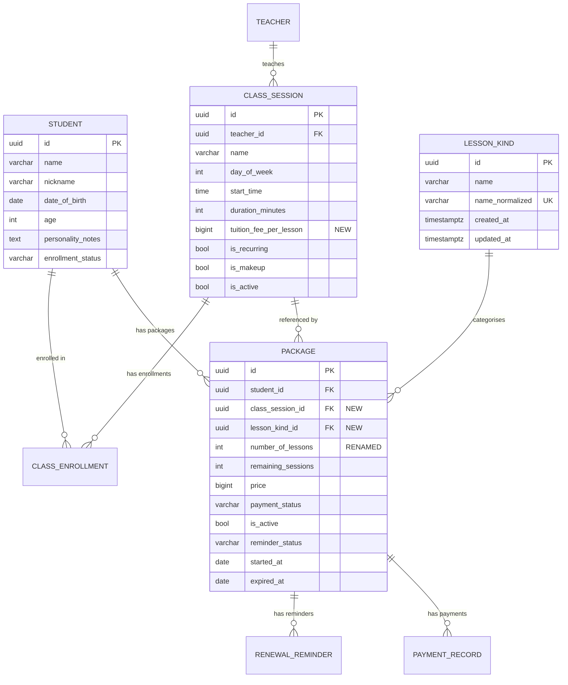

# Data Model: Flexible Course Package with Class Catalog & Lesson Kind Vocabulary

**Feature**: 003-flexible-course-package
**Date**: 2026-04-27
**Spec**: [spec.md](./spec.md) | **Plan**: [plan.md](./plan.md)

---

## Entity: LessonKind (NEW)

A passive, append-only vocabulary entry representing a name used to classify a course package.

### Table: `lesson_kinds`

| Column | Type | Constraints | Notes |
|--------|------|-------------|-------|
| `id` | `UUID` | PK, default `gen_random_uuid()` | Stable identifier; used as FK target |
| `name` | `VARCHAR(100)` | NOT NULL | Display form (preserves original casing and spacing) |
| `name_normalized` | `VARCHAR(100)` | NOT NULL, UNIQUE (functional index on `LOWER(TRIM(name))`) | Lowercase/trimmed form for uniqueness enforcement |
| `created_at` | `TIMESTAMPTZ` | NOT NULL, default `NOW()` | |
| `updated_at` | `TIMESTAMPTZ` | NOT NULL, default `NOW()` | Updated on any change (unlikely — append-only) |

### Indexes

| Name | Columns | Type |
|------|---------|------|
| `pk_lesson_kinds` | `id` | Primary Key |
| `uq_lesson_kind_name_normalized` | `LOWER(TRIM(name))` | Unique (functional) |

### Validation Rules

- `name`: Required, 1–100 characters, not blank after trimming.
- `name_normalized`: Application computes as `LOWER(TRIM(name))` with collapsed internal whitespace.
- Case-insensitive duplicate detection: if `name_normalized` matches an existing row, reuse that row (no insert).

### Relationships

- Referenced by: `Package.lesson_kind_id` (FK, ON DELETE RESTRICT)

### Seed Data

| name | name_normalized |
|------|-----------------|
| Beginner | beginner |
| Elementary | elementary |
| Intermediate | intermediate |
| Advanced | advanced |

---

## Entity: ClassSession (MODIFIED)

Existing entity from spec 001. Changes: add `tuition_fee_per_lesson`; add computed `display_id` property.

### Table: `class_sessions` — New/Modified Columns Only

| Column | Type | Constraints | Notes |
|--------|------|-------------|-------|
| `tuition_fee_per_lesson` | `BIGINT` | NULLABLE (legacy rows), CHECK (`tuition_fee_per_lesson > 0`), CHECK (`tuition_fee_per_lesson <= 100000000`) | VND per lesson. Nullable for existing rows that predate this feature; required on new creates. Admin-only visibility. |

All existing columns (`id`, `teacher_id`, `name`, `day_of_week`, `start_time`, `duration_minutes`, `is_recurring`, `is_makeup`, `makeup_for_id`, `specific_date`, `is_active`, `created_at`, `updated_at`) remain unchanged.

### Computed Property: `display_id`

Not stored in the database. Computed at query time in the application layer.

**Format**: `{TeacherFirstName}-{Weekday3}-{HHMM}[-{N}]`

| Component | Source | Example |
|-----------|--------|---------|
| `TeacherFirstName` | `teachers.full_name.split()[0]` | "Jane" from "Jane Doe" |
| `Weekday3` | `DAY_ABBR[class_sessions.day_of_week]` where `DAY_ABBR = ["Mon","Tue","Wed","Thu","Fri","Sat","Sun"]` | "Mon" for `day_of_week=0` |
| `HHMM` | `class_sessions.start_time` formatted as `%H%M` | "1730" for 17:30 |
| `-{N}` | Sequential suffix starting at 2, assigned by `created_at` order among classes sharing the same base ID | "-2" for the second class with base "Jane-Mon-1730" |

**Derivation rules**:
1. Group all classes by `(TeacherFirstName, Weekday3, HHMM)`.
2. Within each group, sort by `created_at` ascending.
3. First class: no suffix. Second class: `-2`. Third: `-3`, etc.
4. If a class is rescheduled away from a collision, the display ID recomputes: the suffix may drop.

### Validation Rules (new field)

- `tuition_fee_per_lesson`: When provided, must be a positive integer ≤ 100,000,000 VND.
- On class create (from this feature onward): required (NOT NULL enforcement in schema, not DB column — legacy rows stay NULL).
- On class update: optional (only updates if provided).

### New Relationships

- Referenced by: `Package.class_session_id` (FK, ON DELETE RESTRICT)

---

## Entity: Package (RESTRUCTURED)

The package data store is dropped and rebuilt. The fixed `package_type` enum is removed in favor of a free `number_of_lessons` integer; new required FKs to `ClassSession` and `LessonKind`.

### Table: `packages` (rebuilt)

| Column | Type | Constraints | Notes |
|--------|------|-------------|-------|
| `id` | `UUID` | PK, default `gen_random_uuid()` | |
| `student_id` | `UUID` | NOT NULL, FK → `students.id`, INDEX | |
| `class_session_id` | `UUID` | NOT NULL, FK → `class_sessions.id` (ON DELETE RESTRICT) | Links package to a specific class |
| `lesson_kind_id` | `UUID` | NOT NULL, FK → `lesson_kinds.id` (ON DELETE RESTRICT) | Links package to a lesson kind |
| `number_of_lessons` | `INTEGER` | NOT NULL, CHECK (`number_of_lessons > 0`), CHECK (`number_of_lessons <= 500`) | Admin-entered lesson count (replaces fixed `package_type`) |
| `remaining_sessions` | `INTEGER` | NOT NULL | Starts at `number_of_lessons`; decremented on attendance |
| `price` | `BIGINT` | NOT NULL, CHECK (`price > 0`), CHECK (`price <= 1000000000`) | Tuition fee in VND (auto-filled or manually entered by admin). Immutable after save. |
| `payment_status` | `VARCHAR(20)` | NOT NULL, default `'unpaid'`, INDEX | One of: `unpaid`, `partial`, `paid` |
| `is_active` | `BOOLEAN` | NOT NULL, default `TRUE`, INDEX | |
| `reminder_status` | `VARCHAR(20)` | NOT NULL, default `'none'` | One of: `none`, `sent`, `dismissed` |
| `started_at` | `DATE` | NOT NULL | |
| `expired_at` | `DATE` | NULLABLE | |
| `created_at` | `TIMESTAMPTZ` | NOT NULL, default `NOW()` | |
| `updated_at` | `TIMESTAMPTZ` | NOT NULL, default `NOW()` | |

### Indexes

| Name | Columns | Type |
|------|---------|------|
| `pk_packages` | `id` | Primary Key |
| `ix_packages_student_id` | `student_id` | Index |
| `ix_packages_payment_status` | `payment_status` | Index |
| `ix_packages_is_active` | `is_active` | Index |

### Dropped Columns (vs. previous schema)

| Column | Reason |
|--------|--------|
| `package_type` (`VARCHAR(20)`, values "12"/"24"/"36"/"custom") | Replaced by free `number_of_lessons` integer (FR-012) |
| `total_sessions` | Renamed to `number_of_lessons` for clarity |

### Validation Rules

- `number_of_lessons`: Positive integer, 1–500 (FR-013).
- `price` (tuition_fee): Positive integer, 1–1,000,000,000 VND (FR-018).
- `student_id` + `class_session_id`: The student MUST be enrolled in the class (verified at application level via `class_enrollments` table, FR-015b). Not enforced by DB constraint — requires cross-table check.
- One active package per student: On create, deactivate any existing active package for the same student (spec 001 invariant preserved, FR-020).
- Core fields (`student_id`, `class_session_id`, `number_of_lessons`, `lesson_kind_id`, `price`) are immutable after save (FR-023). Enforced at application level.

### Relationships

| Relationship | Type | Target | Notes |
|-------------|------|--------|-------|
| `student` | Many-to-One | `Student` | Eager load (`selectin`) |
| `class_session` | Many-to-One | `ClassSession` | Eager load (`selectin`) — needed for display ID derivation |
| `lesson_kind` | Many-to-One | `LessonKind` | Eager load (`selectin`) — needed for kind name display |
| `payments` | One-to-Many | `PaymentRecord` | Back-populates |

### State Transitions

```
Package lifecycle:
  CREATE → is_active=True, remaining_sessions=number_of_lessons
  ATTENDANCE → remaining_sessions -= 1 (can go negative per spec 001)
  DEACTIVATE → is_active=False (via new package assignment or admin action)
  PAYMENT → payment_status transitions: unpaid → partial → paid
```

---

## Entity: Student (MODIFIED)

### Table: `students` — Dropped Columns

| Column | Type | Reason |
|--------|------|--------|
| `skill_level` | `VARCHAR(50)`, NOT NULL, INDEX | Removed per spec clarification. Skill-level context captured in free-text `personality_notes` field with updated placeholder hint. |

All other columns remain unchanged.

### Schema Changes

- `StudentCreate`: Drop `skill_level` field (required → removed).
- `StudentUpdate`: Drop `skill_level` field.
- `StudentResponse`: Drop `skill_level` field.
- `StudentListItem`: Drop `skill_level` field.
- Frontend forms: Remove skill_level input; update `personality_notes` placeholder to `"e.g., currently at intermediate level, struggles with sight-reading"`.

---

## Entity: PaymentRecord (REBUILT — same schema)

Dropped and recreated to reference the new `packages` table. No structural changes to the table itself.

### Table: `payment_records`

| Column | Type | Constraints |
|--------|------|-------------|
| `id` | `UUID` | PK |
| `package_id` | `UUID` | NOT NULL, FK → `packages.id` |
| `amount` | `BIGINT` | NOT NULL |
| `payment_date` | `DATE` | NOT NULL |
| `payment_method` | `VARCHAR(50)` | NULLABLE |
| `notes` | `TEXT` | NULLABLE |
| `recorded_by` | `UUID` | FK → `users.id` |
| `created_at` | `TIMESTAMPTZ` | NOT NULL |

---

## Entity: RenewalReminder (REBUILT — same schema)

Dropped and recreated to reference the new `packages` table. No structural changes.

### Table: `renewal_reminders`

| Column | Type | Constraints |
|--------|------|-------------|
| `id` | `UUID` | PK |
| `package_id` | `UUID` | NOT NULL, FK → `packages.id` |
| `reminder_type` | `VARCHAR(20)` | NOT NULL |
| `triggered_at` | `TIMESTAMPTZ` | NOT NULL |
| `created_at` | `TIMESTAMPTZ` | NOT NULL |

---

## Entity Relationship Diagram



---

## Migration Plan

**Migration file**: `012_flexible_course_package.py`

**Upgrade steps** (in order):
1. Create `lesson_kinds` table with unique index
2. Seed initial lesson kinds (Beginner, Elementary, Intermediate, Advanced)
3. Add `tuition_fee_per_lesson` column to `class_sessions` (BIGINT, nullable, with CHECK constraints)
4. Drop `skill_level` column from `students`
5. Drop `renewal_reminders` table
6. Drop `payment_records` table
7. Drop `packages` table
8. Create new `packages` table with `class_session_id` and `lesson_kind_id` FKs
9. Create new `payment_records` table (FK → new packages)
10. Create new `renewal_reminders` table (FK → new packages)

**Downgrade steps**: Reverse of upgrade (recreate old schemas, re-add `skill_level` with default, drop `lesson_kinds`, etc.)
