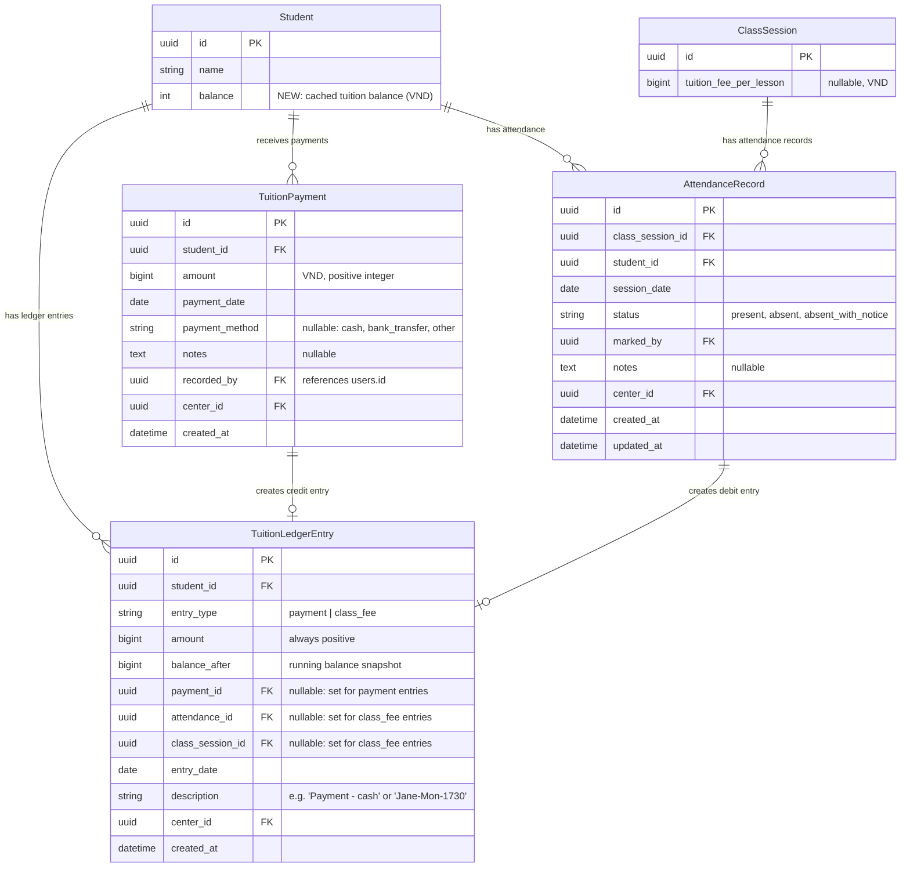

# Data Model: Tuition Revamp — Balance-Based Fee Tracking

**Date**: 2026-04-28 | **Spec**: [spec.md](./spec.md) | **Plan**: [plan.md](./plan.md)

## Entity Relationship Diagram



## New Entities

### TuitionPayment

Replaces the package-centric `PaymentRecord`. Records money received from/for a student, linked directly to the student (not to a package).

| Field | Type | Nullable | Constraints | Notes |
|-------|------|----------|-------------|-------|
| `id` | UUID | No | PK, default gen | |
| `student_id` | UUID | No | FK → `students.id`, indexed | |
| `amount` | BigInteger | No | > 0, ≤ 1,000,000,000 | VND |
| `payment_date` | Date | No | | Defaults to today in service layer |
| `payment_method` | String(50) | Yes | Enum-like: cash, bank_transfer, other | |
| `notes` | Text | Yes | | Free text |
| `recorded_by` | UUID | No | FK → `users.id` | Admin who recorded |
| `center_id` | UUID | No | FK → `centers.id`, indexed | Multi-tenant |
| `created_at` | DateTime(tz) | No | Auto-set | |

**Indexes**: `student_id`, `center_id`, `payment_date`

### TuitionLedgerEntry

An individual balance-affecting event. Each payment creates a credit entry; each "present" attendance creates a debit entry.

| Field | Type | Nullable | Constraints | Notes |
|-------|------|----------|-------------|-------|
| `id` | UUID | No | PK, default gen | |
| `student_id` | UUID | No | FK → `students.id`, indexed | |
| `entry_type` | String(20) | No | `payment` or `class_fee` | Discriminator |
| `amount` | BigInteger | No | > 0 | Always positive; sign from type |
| `balance_after` | BigInteger | No | | Running balance snapshot after this entry |
| `payment_id` | UUID | Yes | FK → `tuition_payments.id` | Set for `payment` entries |
| `attendance_id` | UUID | Yes | FK → `attendance_records.id` | Set for `class_fee` entries |
| `class_session_id` | UUID | Yes | FK → `class_sessions.id` | Set for `class_fee` entries; display ID derived |
| `entry_date` | Date | No | | Payment date or session date |
| `description` | String(200) | No | | Human-readable: "Payment - cash" or "Jane-Mon-1730" |
| `center_id` | UUID | No | FK → `centers.id`, indexed | Multi-tenant |
| `created_at` | DateTime(tz) | No | Auto-set | |

**Indexes**: `student_id` + `created_at` (composite, for chronological ledger query), `center_id`, `entry_date`

**Uniqueness constraint**: `(attendance_id)` where `attendance_id IS NOT NULL` — prevents duplicate deductions for the same attendance record.

## Modified Entities

### Student

**Added field**:

| Field | Type | Nullable | Default | Notes |
|-------|------|----------|---------|-------|
| `balance` | BigInteger | No | 0 | Cached tuition balance in VND. Updated atomically with each ledger entry. Can be negative. |

### AttendanceRecord

**Removed field**:

| Field | Removed Reason |
|-------|----------------|
| `package_id` | FK → `packages.id`. Package model is dropped. Attendance no longer references packages. |

## Dropped Entities

### Package (`packages` table)
Entire table dropped. The package concept (N lessons, remaining_sessions, payment_status) is retired. No migration of data.

### PaymentRecord (`payment_records` table)
Entire table dropped. Replaced by `TuitionPayment` which links to student directly instead of package.

## State Transitions

### Student Balance
```
balance = 0  (initial / new student)
    ↓ Payment recorded (+amount)
balance = +N
    ↓ Marked "present" at class (-class_fee)
balance = N - class_fee
    ↓ ... continues with more payments and attendance
balance = (can be positive, zero, or negative)
```

No state machine — balance is a continuous numeric value with no discrete states. Visual indicators are derived:
- `balance > 0` → Green (positive, has credit)
- `balance == 0` → Neutral
- `balance < 0` → Red (owing, needs payment)

### Ledger Entry Types
- `payment` → **Credit** → balance increases
- `class_fee` → **Debit** → balance decreases

## Validation Rules

1. **TuitionPayment.amount**: Must be positive integer, ≤ 1,000,000,000 VND
2. **TuitionPayment.student_id**: Must reference an existing student in the same center
3. **TuitionPayment.recorded_by**: Must be an admin user
4. **TuitionLedgerEntry.attendance_id**: Unique (partial index where NOT NULL) — prevents double deductions
5. **Balance deduction**: Only occurs when attendance status is "present" AND class has `tuition_fee_per_lesson > 0`
6. **Balance reversal**: When attendance changes from "present" to non-present, the debit ledger entry is soft-reversed by creating a new credit entry (or the debit entry amount is negated and balance recalculated — implementation choice)
